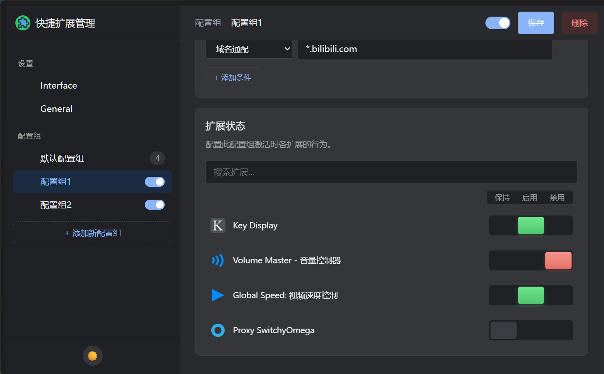

# Auto Extension Manager

[English](./readme_en.md) | 中文

一个智能的 Chrome 扩展，用于自动化管理你的 Chrome 扩展程序。

本项目为 [one-click-extensions-manager](https://github.com/hankxdev/one-click-extensions-manager)
的二次开发版本,实现了更智能的拓展管理,根据网址自动切换你所使用的拓展.

本扩展目前由 [MoeSnowyFox](https://github.com/MoeSnowyFox) 和 [copilot](https://github.com/features/copilot) 开发和维护.

✿✿ヽ(°▽°)ノ✿✿

## 安装

您可以自行编译并运行此拓展,暂未上传拓展商店.

## 国际化

目前支持多种语言：

- English (United States)
- 中文 (简体)

以下语言使用AI(_GPT-4o_)翻译
若有错误请提出issue,欢迎您的pr

- 中文 (繁體)
- Italiano
- Deutsch
- Español
- Français
- עברית
- 日本語
- 한국어
- русский
- Türkçe
- Nederlands
- Polski
- Latviešu

## 许可协议

MIT © [MoeSnowyFox](https://github.com/MoeSnowyFox), [Hank Yang](https://momane.com/), [Federico Brigante](https://fregante.com/)

## 鸣谢

感谢 [one-click-extensions-manager](https://github.com/hankxdev/one-click-extensions-manager) 的作者和贡献者
